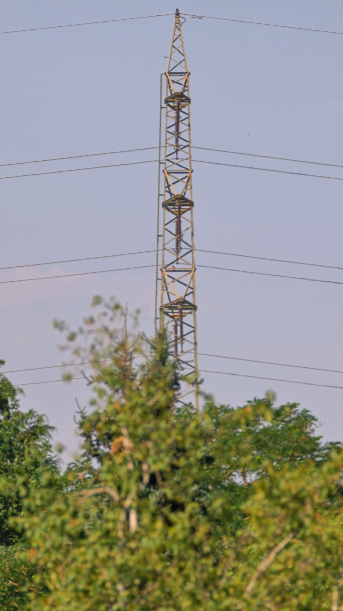

# Seestar Plane Tracker

Tracks aircraft with a [Seestar S30 Pro](https://www.zwoastro.com/product/seestar-s30/) smart telescope.
Polls live ADS-B data, picks the best in-sector aircraft, converts its position to equatorial
coordinates, and steers the mount via the Seestar's native TCP protocol — no third-party packages
required.

## Requirements

- Python 3.11+
- Seestar S30 Pro on the same WiFi network (or in AP mode)
- Seestar firmware 7.18+ (RSA auth is handled automatically)

## Setup

```
cp config.sample.toml config.toml
# edit config.toml — set your coordinates and Seestar hostname
python3 seestar_track.py --dry-run   # verify without connecting to the telescope
python3 seestar_track.py             # live tracking
```

## Configuration (`config.toml`)

### `[observer]`

| Key | Meaning |
|---|---|
| `center_lat` / `center_lon` | Observer coordinates (decimal degrees) |
| `radius_km` | ADS-B search radius in km |
| `observer_alt_m` | GPS / WGS-84 ellipsoidal height in metres (optional) |
| `geoid_offset_m` | Geoid undulation N; MSL = `observer_alt_m − geoid_offset_m` (optional) |

### `[seestar]`

| Key | Default | Meaning |
|---|---|---|
| `host` | — | Hostname or IP of the Seestar |
| `pem` | — | Path to RSA private key PEM (see below) |
| `port` | 4700 | TCP port |
| `sector_start` / `sector_end` | 360° | Observable arc in compass degrees |
| `poll_interval_s` | 2.0 | Loop cadence in seconds |
| `sun_exclusion_deg` | 30.0 | Min degrees from sun (hard floor: 15°) |
| `slew_time_s` | 16.0 | Predictive offset — observed slew duration |
| `lookahead_s` | 90.0 | Seconds ahead to look for approaching aircraft |
| `target_callsign` | — | Lock onto a specific callsign (optional) |
| `target_hex` | — | Lock onto a specific Mode-S hex (optional) |
| `az_offset_deg` | 0.0 | Compass correction in degrees (see [Pointing accuracy](#pointing-accuracy-and-compass-calibration)) |

## RSA private key (firmware 7.18+)

The Seestar's official Mac app ships the private key used for authentication:

```
/Applications/Seestar.app/Wrapper/Seestar.app/my_private.pem
```

Set `pem` in `config.toml` to this path. Leave it empty only on older firmware.

## How it works

1. Connects to the Seestar and switches to **Scenery mode** (100 ms daytime exposure, no autofocus).
2. Every `poll_interval_s` seconds: fetches aircraft from [adsb.lol](https://adsb.lol) or
   [adsb.one](https://adsb.one), picks the in-sector aircraft with the lowest angular rate.
3. Uses dead-reckoning to project the aircraft's position `slew_time_s` seconds forward.
4. Converts the predicted alt/az to RA/Dec and sends a `scope_goto` command.

## Sun safety

Two independent checks prevent the mount from pointing at the sun:

- Target selection rejects any aircraft within `sun_exclusion_deg` (default 30°).
- A hard gate before every goto blocks anything within 15° — this limit cannot be configured below 15°.
- On startup the script checks the current scope pointing and refuses to run if it is already too close to the sun.

## Pointing accuracy and compass calibration

> **The Seestar must be in alt/az mode**, not EQ (equatorial) mode.
> After a night session the app may leave the mount in EQ mode — check the mode
> indicator in the Seestar app before starting a daytime session and switch back
> to alt/az if needed. The compass calibration is only meaningful in alt/az mode.

### Why the compass matters

In alt/az mode the Seestar determines its azimuth orientation from an internal
magnetometer. Consumer-grade magnetometers are typically accurate to **±5–15°**
depending on nearby metal surfaces, electronics, and local magnetic anomalies.
The accelerometer used for leveling is much more accurate (±0.5–1°), so altitude
errors are usually negligible.

A 5–10° azimuth bias means every `scope_goto` misses consistently in the same
direction. Because the error is fixed for a given setup location, a one-time
offset correction is sufficient — no recalibration is needed during a session
unless the Seestar is physically moved or restarted.

### Step 1 — Hardware compass calibration (Seestar app)

Before measuring any residual offset, calibrate the Seestar's compass in the app:

**Me → Advanced Features → Level & Compass Calibration**

Follow the on-screen instructions (typically: rotate the Seestar slowly through
360° while keeping it level). Repeat if pointing is still far off after calibration.
A well-calibrated compass leaves only a small residual error (a few degrees) that
can then be dialled in with `az_offset_deg`.

### Step 2 — Measuring the residual offset with the Seestar widefield view

1. **Start the tracker** and let it slew to an aircraft.
2. **Pause the script** (Ctrl-C) immediately after the slew.
3. In the Seestar app, switch to **widefield mode** to see where the scope is
   actually pointing.
4. Note where the aircraft appears relative to the center crosshair:
   - **Aircraft is to the right of center** → scope pointed too far left
     (azimuth too low) → use a **positive** `az_offset_deg`
   - **Aircraft is to the left of center** → scope pointed too far right
     (azimuth too high) → use a **negative** `az_offset_deg`

### Estimating the angle from the widefield view

The widefield FOV of the Seestar S30 Pro is approximately **9° × 5°**
(horizontal × vertical). Use this to convert a pixel offset to degrees:

```
offset_deg ≈ (pixel distance from center / half image width in pixels) × 4.5°
```

For example, if the aircraft appears one-third of the way from the center to the
right edge, the offset is roughly `0.33 × 4.5° ≈ 1.5°`.

Alternatively, use a **known landmark** — this gives a more reliable measurement
than a moving aircraft:



1. Pick a distant, unambiguous landmark visible from your location (high-voltage
   pylon, church tower, antenna mast). The farther away, the better.
2. Determine its exact compass bearing from your position (see tools below).
3. Use `--goto-az` to slew the scope to that bearing (step 3 below).
4. Fine-tune until the landmark is centred in the telephoto view.
5. The difference between the commanded azimuth and the true bearing is your offset.

#### Finding the compass bearing to a landmark

The bearing between two geographic coordinates is called the **forward azimuth**
(0° = north, clockwise). Several free tools compute it directly:

- **Google Maps** — right-click your position → *Measure distance*, then
  click the landmark. The bearing is not shown directly, but you can read off
  both sets of coordinates and paste them into one of the calculators below.
- **Movable Type Scripts** — paste two lat/lon pairs into the bearing calculator
  at [movable-type.co.uk/scripts/latlong.html](https://www.movable-type.co.uk/scripts/latlong.html)
  (see "Bearing" section). Good explanations of the underlying maths.
- **CalTopo / SARTopo** — free topographic map tool at
  [caltopo.com](https://caltopo.com). Draw a line between two points; the
  bearing is shown in the line properties panel.
- **OpenTopoMap + coordinates** — use [opentopomap.org](https://opentopomap.org)
  to identify the landmark visually, read its coordinates from the URL or cursor,
  then compute the bearing with one of the tools above.

All tools report **true north** bearings. The Seestar's compass also references
true north (it applies magnetic declination automatically using the GPS location),
so no manual declination correction is needed.

### Step 3 — Slewing to a specific azimuth

The Seestar app does not expose a raw azimuth input in scenery mode. Use the
`--goto-az` / `--goto-el` flags instead — the script connects, slews once,
and exits:

```
python3 seestar_track.py --goto-az 245 --goto-el 5
```

This is the recommended way to point at a calibration landmark. The script
applies the sun safety check before every goto, so it is safe to use freely.

**Important:** set `az_offset_deg = 0` in `config.toml` before measuring the
compass error, so the raw mechanical pointing is what you observe.

### Step 4 — Applying the correction

Set `az_offset_deg` in `config.toml`:

```toml
[seestar]
az_offset_deg = 7.0   # scope was pointing 7° left of target
```

The correction is applied to every goto before the az/el → RA/Dec conversion.
When non-zero, the log will show `az_off +7.0°` on each line so you can confirm
it is active.

Re-measure after any of these events: moving the Seestar to a new location,
restarting the app, or noticing a sudden change in pointing accuracy.

## ADS-B data sources

| Source | Notes |
|---|---|
| [adsb.lol](https://api.adsb.lol) | Primary; ODbL licence, no key required |
| [adsb.one](https://api.adsb.one) | Fallback; no key required |
